<h2>👋 Hello! I'm Daniel.</h2>

- 🏢 I'm currently working at  [**Sener**](https://www.group.sener/) as a **Software Developer**
- 🎓 **Multiplatform Application Development (DAM)**  
- 📱 Building  [**You Suite**](https://yousuite.app), a CRM app for MLM entrepreneurs
- 🚀 Skilled in: Flutter/Dart, Java, C#, .NET, Angular, Node.js, TypeScript, JavaScript & PostgreSQL  
- 🤝 Open to collaborations & new opportunities   [LinkedIn](https://es.linkedin.com/in/danielalonsomendez) ·  [Email](mailto:dani@danialonso.dev)

